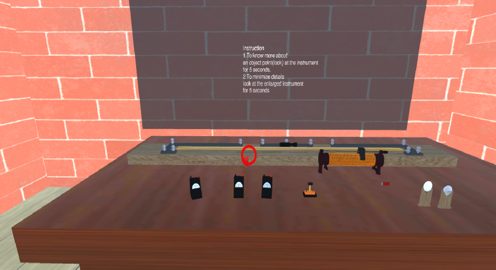
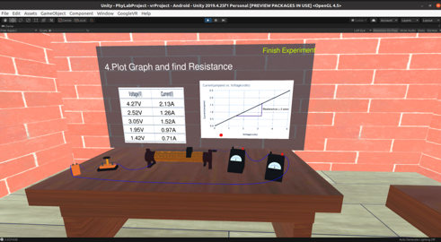
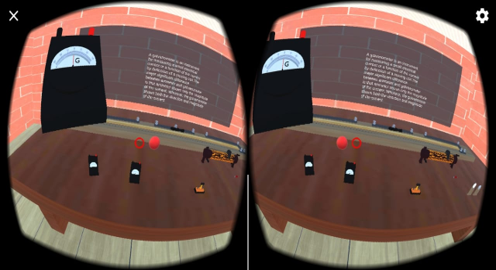
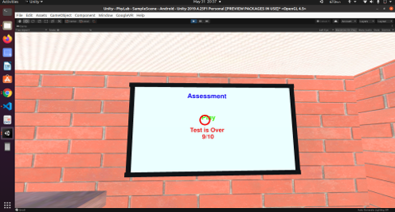

# 🧪 Physics Lab in Virtual Reality

<div align="center">

[](https://unity.com/)
[](https://docs.microsoft.com/en-us/dotnet/csharp/)
[](https://www.android.com/)
[]()

**A B.Tech Final Year Project (CS492)**  
_Department of Computer Science and Engineering, Government College of Engineering Kannur_

</div>

---

## 📖 Overview

**Physics Lab in VR** is an immersive educational application designed to bridge the gap between theoretical knowledge and practical application. Developed during the COVID-19 pandemic to address the lack of physical lab access, this project allows higher secondary students to perform physics experiments in a safe, interactive 3D environment.

Using a mobile VR headset and a Bluetooth controller, students can familiarize themselves with lab equipment, perform experiments (such as Ohm's Law), and assess their knowledge through interactive quizzes.

---

## 🎥 Video Demo

Watch the full walkthrough of the Virtual Reality Lab in action, including the Ohm's Law experiment simulation and the assessment module.

[![Watch the video]](https://youtu.be/4Zx2zvwCKbI)

---

## ✨ Key Features

### 1. 🔍 Equipment Familiarization

- **Interactive Learning:** Students can gaze at various instruments (Voltmeter, Ammeter, Rheostat, etc.) on the virtual table.
- **3D Inspection:** Selected instruments are enlarged and rotated in 3D space.
- **Detailed Info:** Displays usage descriptions and technical details for every component.

### 2. ⚡ Experiment Simulation (Ohm's Law)

- **Circuit Building:** Users interactively connect the circuit components.
- **Real-time Simulation:** Adjust the **Rheostat** slider to change resistance.
- **Data Recording:** The system automatically calculates Current and Voltage values based on the simulation.
- **Graph Plotting:** Generates a V-I graph and calculates resistance based on the recorded values.

### 3. 📝 Self-Assessment

- **Mock Tests:** A dedicated quiz section to test the user's understanding.
- **Interactive UI:** Select answers using the gaze pointer and controller.
- **Scoring:** Instant feedback and final score display.

---

## 📸 Screenshots

_(Please upload screenshots to a folder named `screenshots` in your repo and update the links below)_

|      **Virtual Lab Environment**      |           **Ohm's Law Experiment**           |
| :-----------------------------------: | :------------------------------------------: |
|  |     |
| _The central hub for all activities_  | _Connecting circuits and adjusting rheostat_ |

|    **Equipment Familiarization**    |          **Assessment Module**          |
| :---------------------------------: | :-------------------------------------: |
|  |    |
|  _3D rendering of lab instruments_  | _Interactive question and answer board_ |

---

## 🛠️ Tech Stack & Tools

- **Game Engine:** [Unity3D](https://unity.com/) (Real-time development platform)
- **Scripting:** C#
- **3D Modeling:** [Blender](https://www.blender.org/) (Used for rendering lab instruments and furniture)
- **VR SDK:** Google Cardboard / Unity XR
- **IDE:** Visual Studio

---

## ⚙️ Hardware Requirements

To run this application, the user requires:

1.  **Smartphone:** Android device with Gyroscope sensor.
2.  **VR Headset:** Google Cardboard, VR Box, or similar mobile VR headset.
3.  **Controller:** Bluetooth Handheld Controller (for button inputs).

---

## 🕹️ How to Use (User Manual)

The application workflow depends on the user's **Gaze Direction**:

1.  **Look Left (Experiment Section):**

    - Focus on instruments to "pick" them up.
    - Build the circuit.
    - Use the controller to adjust the Rheostat slider.
    - Record 5 sets of readings to generate the graph.

2.  **Look Center (Familiarization):**

    - Gaze at an instrument to see it in 3D.
    - Read the description panel that appears.

3.  **Look Right (Assessment):**

    - Click "Start" on the quiz board.
    - Select options (A, B, C, D) using the pointer.
    - View your final score at the end.

4.  **Look Back (Door):**
    - Gaze at the door to **Exit** the application.

---

## 🚀 Installation

1.  **Clone the Repository:**
    ```bash
    git clone https://github.com/yourusername/Physics-Lab-VR.git
    ```
2.  **Open in Unity:**
    - Launch Unity Hub.
    - Click "Open" and select the cloned folder.
3.  **Build for Android:**
    - Go to `File` > `Build Settings`.
    - Switch platform to **Android**.
    - Connect your phone via USB (Debugging enabled).
    - Click `Build and Run`.

---

## 👥 The Team

**Submitted by:**

- Alka V N
- Namitha Manikandan
- Sikha S Raj
- Thejaswi A G

**Under the Guidance of:**

- **Prof. Asjad Nabeel P** (Asst. Professor, Dept. of CSE, GCE Kannur)

---

## 📄 License

This project is licensed under the MIT License - see the [LICENSE](LICENSE) file for details.

---

<div align="center">
  <sub>Built with ❤️ at Government College of Engineering, Kannur | 2020-2021</sub>
</div>
